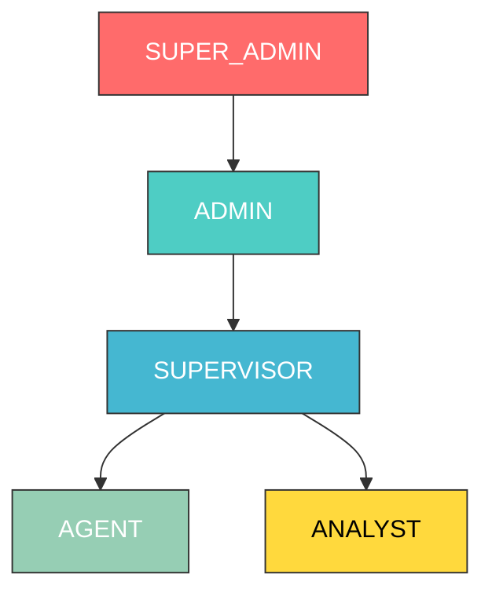

# Sistema de Autenticação e Controle de Acesso (RBAC)

## 🏗️ Arquitetura do Sistema de Permissões

### **Hierarquia de Roles Proposta:**



## 🔐 Definição de Roles e Permissions

### **1. SUPER_ADMIN** (Nível Máximo)
```typescript
const SUPER_ADMIN_PERMISSIONS = [
  // Sistema
  'system:manage',
  'system:settings',
  'system:backup',
  'system:logs',
  
  // Usuários (todos os tipos)
  'users:create',
  'users:read',
  'users:update',
  'users:delete',
  'users:manage_roles',
  
  // Números WhatsApp
  'numbers:create',
  'numbers:read',
  'numbers:update',
  'numbers:delete',
  'numbers:configure',
  
  // Times
  'teams:create',
  'teams:read',
  'teams:update',
  'teams:delete',
  'teams:manage_members',
  
  // Conversas (todas)
  'conversations:read_all',
  'conversations:assign_any',
  'conversations:transfer_any',
  
  // Relatórios (todos)
  'reports:view_all',
  'reports:export',
  
  // Billing
  'billing:view',
  'billing:manage'
];
```

### **2. ADMIN** (Administrador de Conta)
```typescript
const ADMIN_PERMISSIONS = [
  // Usuários (exceto SUPER_ADMIN)
  'users:create',
  'users:read',
  'users:update',
  'users:delete', // apenas níveis abaixo
  'users:manage_roles', // apenas níveis abaixo
  
  // Números WhatsApp
  'numbers:read',
  'numbers:update',
  'numbers:configure',
  
  // Times
  'teams:create',
  'teams:read',
  'teams:update',
  'teams:delete',
  'teams:manage_members',
  
  // Conversas
  'conversations:read_all',
  'conversations:assign_any',
  'conversations:transfer_any',
  
  // Relatórios
  'reports:view_all',
  'reports:export',
  
  // Billing (apenas visualização)
  'billing:view'
];
```

### **3. SUPERVISOR** (Gerente de Time)
```typescript
const SUPERVISOR_PERMISSIONS = [
  // Usuários do próprio time
  'users:read_team',
  'users:update_team',
  
  // Times (apenas o próprio)
  'teams:read_own',
  'teams:update_own',
  'teams:manage_members_own',
  
  // Conversas do time
  'conversations:read_team',
  'conversations:assign_team',
  'conversations:transfer_team',
  
  // Números do time
  'numbers:read_team',
  
  // Relatórios do time
  'reports:view_team',
  'reports:export_team',
  
  // Agentes
  'agents:monitor',
  'agents:assign_conversations'
];
```

### **4. AGENT** (Atendente)
```typescript
const AGENT_PERMISSIONS = [
  // Perfil próprio
  'users:read_self',
  'users:update_self',
  
  // Conversas atribuídas
  'conversations:read_assigned',
  'conversations:reply',
  'conversations:update_assigned',
  
  // Times (apenas visualização)
  'teams:read_own',
  
  // Relatórios próprios
  'reports:view_self'
];
```

### **5. ANALYST** (Analista - Apenas Relatórios)
```typescript
const ANALYST_PERMISSIONS = [
  // Perfil próprio
  'users:read_self',
  'users:update_self',
  
  // Conversas (apenas leitura)
  'conversations:read_team',
  
  // Relatórios avançados
  'reports:view_team',
  'reports:view_advanced',
  'reports:export_team',
  'reports:create_dashboards'
];
```

## 🗄️ Schema do Banco de Dados

```sql
-- Tabela de Roles
CREATE TABLE roles (
  id UUID PRIMARY KEY DEFAULT gen_random_uuid(),
  name VARCHAR(50) UNIQUE NOT NULL,
  description TEXT,
  level INTEGER NOT NULL, -- hierarquia numérica
  is_system_role BOOLEAN DEFAULT false,
  created_at TIMESTAMP DEFAULT NOW(),
  updated_at TIMESTAMP DEFAULT NOW()
);

-- Tabela de Permissions
CREATE TABLE permissions (
  id UUID PRIMARY KEY DEFAULT gen_random_uuid(),
  name VARCHAR(100) UNIQUE NOT NULL, -- 'users:create'
  resource VARCHAR(50) NOT NULL, -- 'users'
  action VARCHAR(50) NOT NULL, -- 'create'
  description TEXT,
  created_at TIMESTAMP DEFAULT NOW()
);

-- Tabela de Role_Permissions (N:N)
CREATE TABLE role_permissions (
  id UUID PRIMARY KEY DEFAULT gen_random_uuid(),
  role_id UUID REFERENCES roles(id) ON DELETE CASCADE,
  permission_id UUID REFERENCES permissions(id) ON DELETE CASCADE,
  created_at TIMESTAMP DEFAULT NOW(),
  UNIQUE(role_id, permission_id)
);

-- Tabela de Users
CREATE TABLE users (
  id UUID PRIMARY KEY DEFAULT gen_random_uuid(),
  email VARCHAR(255) UNIQUE NOT NULL,
  password_hash VARCHAR(255) NOT NULL,
  first_name VARCHAR(100) NOT NULL,
  last_name VARCHAR(100) NOT NULL,
  role_id UUID REFERENCES roles(id),
  team_id UUID REFERENCES teams(id),
  is_active BOOLEAN DEFAULT true,
  last_login_at TIMESTAMP,
  created_at TIMESTAMP DEFAULT NOW(),
  updated_at TIMESTAMP DEFAULT NOW()
);

-- Tabela de Teams
CREATE TABLE teams (
  id UUID PRIMARY KEY DEFAULT gen_random_uuid(),
  name VARCHAR(100) NOT NULL,
  description TEXT,
  supervisor_id UUID REFERENCES users(id),
  is_active BOOLEAN DEFAULT true,
  created_at TIMESTAMP DEFAULT NOW(),
  updated_at TIMESTAMP DEFAULT NOW()
);
```

## 🔧 Implementação Backend (NestJS)

### **1. Guard de Permissões**
```typescript
// guards/permissions.guard.ts
@Injectable()
export class PermissionsGuard implements CanActivate {
  constructor(private reflector: Reflector) {}
  
  canActivate(context: ExecutionContext): boolean {
    const requiredPermissions = this.reflector.getAllAndOverride<string[]>(
      'permissions',
      [context.getHandler(), context.getClass()]
    );
    
    if (!requiredPermissions) return true;
    
    const { user } = context.switchToHttp().getRequest();
    
    return requiredPermissions.every(permission => 
      user.permissions.includes(permission)
    );
  }
}
```

### **2. Decorator de Permissões**
```typescript
// decorators/permissions.decorator.ts
export const RequirePermissions = (...permissions: string[]) =>
  SetMetadata('permissions', permissions);

// Uso nos controllers:
@RequirePermissions('users:create', 'users:manage_roles')
@Post('users')
async createUser(@Body() createUserDto: CreateUserDto) {
  return this.usersService.create(createUserDto);
}
```

### **3. Service de Autenticação**
```typescript
// auth/auth.service.ts
@Injectable()
export class AuthService {
  async login(email: string, password: string) {
    const user = await this.validateUser(email, password);
    if (!user) throw new UnauthorizedException('Credenciais inválidas');
    
    const permissions = await this.getUserPermissions(user.id);
    
    const payload = {
      sub: user.id,
      email: user.email,
      role: user.role.name,
      permissions: permissions.map(p => p.name)
    };
    
    return {
      access_token: this.jwtService.sign(payload),
      refresh_token: this.jwtService.sign(payload, { expiresIn: '7d' }),
      user: {
        ...user,
        permissions: permissions.map(p => p.name)
      }
    };
  }
  
  private async getUserPermissions(userId: string) {
    // Query para buscar todas as permissões do usuário via role
    return this.prisma.permission.findMany({
      where: {
        rolePermissions: {
          some: {
            role: {
              users: {
                some: { id: userId }
              }
            }
          }
        }
      }
    });
  }
}
```

## 🎨 Frontend - Controle de Acesso

### **1. Context de Permissões**
```typescript
// contexts/AuthContext.tsx
interface AuthContextType {
  user: User | null;
  permissions: string[];
  hasPermission: (permission: string) => boolean;
  hasAnyPermission: (permissions: string[]) => boolean;
  login: (credentials: LoginCredentials) => Promise<void>;
  logout: () => void;
}

export const useAuth = () => {
  const context = useContext(AuthContext);
  return {
    ...context,
    hasPermission: (permission: string) => 
      context.permissions.includes(permission),
    hasAnyPermission: (permissions: string[]) => 
      permissions.some(p => context.permissions.includes(p))
  };
};
```

### **2. Componente de Proteção**
```typescript
// components/ProtectedRoute.tsx
interface ProtectedRouteProps {
  permissions?: string[];
  fallback?: React.ReactNode;
  children: React.ReactNode;
}

export const ProtectedRoute: React.FC<ProtectedRouteProps> = ({
  permissions = [],
  fallback = <div>Acesso negado</div>,
  children
}) => {
  const { hasAnyPermission } = useAuth();
  
  if (permissions.length === 0) return <>{children}</>;
  
  return hasAnyPermission(permissions) ? <>{children}</> : <>{fallback}</>;
};

// Uso:
<ProtectedRoute permissions={['users:create']}>
  <CreateUserButton />
</ProtectedRoute>
```

## 🚦 Middlewares de Contexto

### **1. Filtro por Contexto**
```typescript
// Exemplo: Supervisor só vê conversas do próprio time
@Get('conversations')
async getConversations(@CurrentUser() user: User) {
  const filter = this.buildContextFilter(user);
  return this.conversationsService.findMany(filter);
}

private buildContextFilter(user: User) {
  switch (user.role.name) {
    case 'SUPER_ADMIN':
    case 'ADMIN':
      return {}; // Sem filtro - vê tudo
      
    case 'SUPERVISOR':
      return { teamId: user.teamId }; // Apenas do time
      
    case 'AGENT':
      return { assignedToId: user.id }; // Apenas atribuídas
      
    default:
      return { id: 'never-match' }; // Nada
  }
}
```

## ✅ Vantagens desta Abordagem

1. **🔒 Segurança Granular:** Controle preciso de cada ação
2. **📈 Escalabilidade:** Fácil adição de novas roles/permissions
3. **🎯 Contexto Dinâmico:** Filtros automáticos por nível
4. **🔧 Manutenibilidade:** Permissões centralizadas e reutilizáveis
5. **👥 Multi-tenant Ready:** Isolamento por time/contexto
6. **📊 Auditoria:** Rastreamento completo de ações

## 🎪 Próximos Passos

1. **Implementar JWT + Refresh Token**
2. **Criar seeders com roles padrão**
3. **Desenvolver interface de gestão de usuários**
4. **Implementar middleware de contexto**
5. **Criar testes de permissão**

Esta estrutura é **enterprise-grade** e utilizada por sistemas como **Salesforce, HubSpot, Zendesk** e outras plataformas profissionais. É totalmente escalável e maintível!